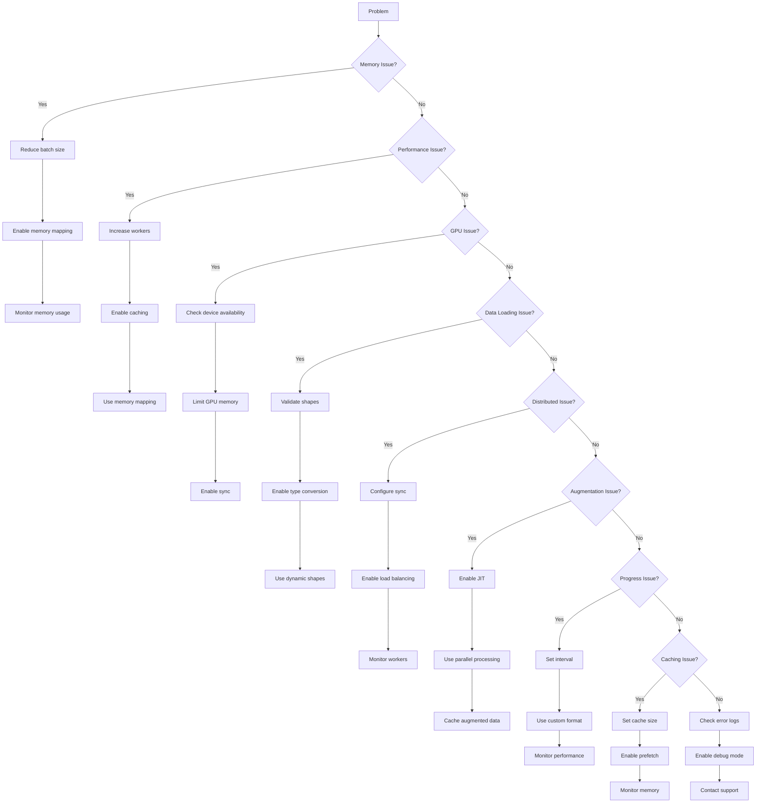

# JAX DataLoader Quick Reference Guide

## Common Issues and Quick Fixes

### 1. Memory Issues
| Issue | Quick Fix |
|-------|-----------|
| Out of Memory | `use_mmap=True, batch_size=16, num_workers=1` |
| Memory Leaks | `cleanup_interval=1000, debug=True` |
| High Memory Usage | `use_pinned_memory=False, prefetch_size=1` |

### 2. Performance Issues
| Issue | Quick Fix |
|-------|-----------|
| Slow Loading | `num_workers=4, prefetch_size=2, use_mmap=True` |
| High CPU Usage | `num_workers=2, worker_type='thread'` |
| Disk I/O Bottleneck | `use_mmap=True, cache_size=1000` |

### 3. GPU Issues
| Issue | Quick Fix |
|-------|-----------|
| CUDA OOM | `gpu_memory_fraction=0.8, batch_size=16` |
| Device Not Found | `device='cpu'` |
| GPU Sync Issues | `sync_every_batch=True` |

### 4. Data Loading
| Issue | Quick Fix |
|-------|-----------|
| Shape Mismatch | `dynamic_shapes=True, padding_value=0` |
| Type Errors | `dtype=jnp.float32, convert_types=True` |
| Batch Size Issues | `validate_shapes(dataset, batch_size)` |

### 5. Distributed Training
| Issue | Quick Fix |
|-------|-----------|
| Sync Errors | `sync_every_batch=True, barrier_timeout=30` |
| Load Imbalance | `dynamic_balancing=True, balance_interval=100` |
| Node Communication | `num_nodes=2, node_rank=0` |

### 6. Augmentation
| Issue | Quick Fix |
|-------|-----------|
| Slow Augmentation | `jit=True, parallel=True` |
| Memory Issues | `cache_augmented=True` |
| Randomness | `seed=42` |

### 7. Progress Tracking
| Issue | Quick Fix |
|-------|-----------|
| No Progress Bar | `show_progress=True` |
| Inaccurate Progress | `progress_interval=1` |
| Performance Impact | `update_interval=10` |

### 8. Caching
| Issue | Quick Fix |
|-------|-----------|
| Cache Memory | `cache_size=1000, eviction_policy='lru'` |
| Cache Thrashing | `cleanup_threshold=0.8` |
| Prefetch Issues | `cache_prefetch=True` |

## Common Error Messages and Solutions

### Memory Errors
```python
# CUDA out of memory
loader = JAXDataLoader(
    dataset=data,
    batch_size=16,  # Reduce batch size
    gpu_memory_fraction=0.8
)

# System out of memory
loader = JAXDataLoader(
    dataset=data,
    use_mmap=True,
    num_workers=1
)
```

### Performance Errors
```python
# Slow data loading
loader = JAXDataLoader(
    dataset=data,
    num_workers=4,
    prefetch_size=2
)

# High CPU usage
loader = JAXDataLoader(
    dataset=data,
    num_workers=2,
    use_mmap=True
)
```

### Data Errors
```python
# Shape mismatch
loader = JAXDataLoader(
    dataset=data,
    dynamic_shapes=True
)

# Type errors
loader = JAXDataLoader(
    dataset=data,
    dtype=jnp.float32,
    convert_types=True
)
```

## Quick Configuration Templates

### Basic Configuration
```python
loader = JAXDataLoader(
    dataset=data,
    batch_size=32,
    num_workers=2,
    prefetch_size=1
)
```

### Memory-Optimized
```python
loader = JAXDataLoader(
    dataset=data,
    batch_size=16,
    use_mmap=True,
    use_pinned_memory=True,
    num_workers=1
)
```

### Performance-Optimized
```python
loader = JAXDataLoader(
    dataset=data,
    batch_size=64,
    num_workers=4,
    prefetch_size=2,
    cache_size=1000
)
```

### GPU-Optimized
```python
loader = JAXDataLoader(
    dataset=data,
    batch_size=32,
    gpu_memory_fraction=0.8,
    device='cuda:0'
)
```

## Advanced Configuration Templates

### Large Dataset Configuration
```python
loader = JAXDataLoader(
    dataset=data,
    batch_size=128,
    num_workers=8,
    prefetch_size=4,
    use_mmap=True,
    cache_size=5000,
    cache_strategy='lru'
)
```

### Small Dataset Configuration
```python
loader = JAXDataLoader(
    dataset=data,
    batch_size=8,
    num_workers=1,
    prefetch_size=1,
    use_pinned_memory=True,
    cache_size=100
)
```

### Mixed Precision Training
```python
loader = JAXDataLoader(
    dataset=data,
    batch_size=32,
    dtype=jnp.float16,  # Use half precision
    convert_types=True,
    gpu_memory_fraction=0.9
)
```

### Multi-GPU Training
```python
loader = JAXDataLoader(
    dataset=data,
    batch_size=64,
    num_workers=4,
    device='cuda:0',
    gpu_memory_fraction=0.7,
    sync_every_batch=True
)
```

### Streaming Data Configuration
```python
loader = JAXDataLoader(
    dataset=data,
    batch_size=32,
    num_workers=2,
    prefetch_size=2,
    use_mmap=True,
    streaming=True,
    cache_size=0  # Disable caching for streaming
)
```

## Use Case Examples

### 1. Image Classification
```python
loader = JAXDataLoader(
    dataset=image_dataset,
    batch_size=32,
    num_workers=4,
    prefetch_size=2,
    augmenter=JAXDataAugmentation(
        augmentations=['random_flip', 'random_rotation', 'color_jitter'],
        probability=0.5
    ),
    cache_size=1000
)
```

### 2. Natural Language Processing
```python
loader = JAXDataLoader(
    dataset=text_dataset,
    batch_size=64,
    num_workers=2,
    dynamic_shapes=True,
    padding_value=0,
    dtype=jnp.int32
)
```

### 3. Video Processing
```python
loader = JAXDataLoader(
    dataset=video_dataset,
    batch_size=8,  # Smaller batches for video
    num_workers=4,
    use_mmap=True,
    cache_size=100,
    gpu_memory_fraction=0.8
)
```

### 4. Reinforcement Learning
```python
loader = JAXDataLoader(
    dataset=replay_buffer,
    batch_size=128,
    num_workers=2,
    shuffle=True,
    cache_size=0  # No caching for RL
)
```

### 5. Federated Learning
```python
loader = JAXDataLoader(
    dataset=client_data,
    batch_size=32,
    num_workers=2,
    distributed_config=DistributedConfig(
        num_nodes=10,
        node_rank=0,
        sync_every_batch=True
    )
)
```

## Troubleshooting Flowchart



## Expanded Parameter Reference Tables

### Memory Optimization
| Parameter | Value | Effect | Recommended For |
|-----------|-------|--------|-----------------|
| `batch_size` | 16-64 | Lower = less memory | Small GPUs, OOM errors |
| `num_workers` | 1-4 | Lower = less memory | Memory-constrained systems |
| `prefetch_size` | 1-2 | Lower = less memory | Streaming data |
| `use_mmap` | True | Reduces memory usage | Large datasets |
| `cache_size` | 0-1000 | Lower = less memory | Memory-sensitive tasks |
| `use_pinned_memory` | False | Reduces memory pressure | CPU-only systems |
| `cleanup_interval` | 100-1000 | More frequent = less memory | Long-running tasks |
| `gpu_memory_fraction` | 0.5-0.8 | Lower = more headroom | Multi-GPU systems |

### Performance Optimization
| Parameter | Value | Effect | Recommended For |
|-----------|-------|--------|-----------------|
| `num_workers` | 2-8 | Higher = better performance | Multi-core CPUs |
| `prefetch_size` | 2-4 | Higher = better performance | Fast storage |
| `cache_size` | 100-5000 | Higher = better performance | Repeated access |
| `use_mmap` | True | Better I/O performance | Large files |
| `worker_type` | 'thread' | Lower overhead | CPU-bound tasks |
| `cache_strategy` | 'lru'/'fifo' | LRU = better hit rate | Mixed access patterns |
| `sync_every_batch` | True | Better consistency | Distributed training |
| `dynamic_balancing` | True | Better load distribution | Uneven workloads |

### GPU Optimization
| Parameter | Value | Effect | Recommended For |
|-----------|-------|--------|-----------------|
| `gpu_memory_fraction` | 0.7-0.9 | Higher = more GPU memory | Single-GPU systems |
| `batch_size` | 32-128 | Higher = better utilization | Large GPUs |
| `sync_every_batch` | True | Better synchronization | Multi-GPU training |
| `device` | 'cuda:0' | Specific GPU device | Multi-GPU systems |
| `use_pinned_memory` | True | Better GPU transfer | GPU-intensive tasks |
| `gpu_prefetch` | True | Better GPU utilization | High-throughput tasks |
| `gpu_cache_size` | 100-1000 | GPU-side caching | Repeated GPU operations |
| `gpu_streams` | 2-4 | Concurrent GPU ops | Multi-stream workloads |

### Data Loading
| Parameter | Value | Effect | Recommended For |
|-----------|-------|--------|-----------------|
| `dynamic_shapes` | True | Flexible batch sizes | Variable-length data |
| `padding_value` | 0/-1 | Batch padding | NLP tasks |
| `dtype` | jnp.float32 | Data type | General purpose |
| `convert_types` | True | Automatic conversion | Mixed data types |
| `shuffle` | True | Random order | Training data |
| `drop_last` | True | Drop incomplete batches | Fixed-size models |
| `collate_fn` | custom | Custom batching | Specialized tasks |
| `sampler` | custom | Custom sampling | Imbalanced data |

## Detailed Troubleshooting Steps

### 1. Memory Issues
1. **Identify Memory Usage**
   ```python
   from jax_dataloader.memory import MemoryTracker
   tracker = MemoryTracker(verbose=True)
   with tracker:
       loader = JAXDataLoader(dataset=data)
   ```

2. **Reduce Memory Footprint**
   - Decrease batch size by 50%
   - Reduce number of workers
   - Disable prefetching
   - Enable memory mapping

3. **Monitor Memory Growth**
   ```python
   from jax_dataloader.memory import MemoryMonitor
   monitor = MemoryMonitor(
       check_interval=100,
       threshold_mb=1024,
       alert=True
   )
   ```

### 2. Performance Issues
1. **Profile Data Loading**
   ```python
   from jax_dataloader.profile import DataLoaderProfiler
   profiler = DataLoaderProfiler(
       track_memory=True,
       track_performance=True,
       track_errors=True
   )
   ```

2. **Optimize Configuration**
   - Increase workers gradually
   - Enable caching
   - Use memory mapping
   - Adjust prefetch size

3. **Monitor System Resources**
   ```python
   from jax_dataloader.monitor import SystemMonitor
   monitor = SystemMonitor(
       track_cpu=True,
       track_memory=True,
       track_disk=True
   )
   ```

### 3. GPU Issues
1. **Check GPU Availability**
   ```python
   from jax_dataloader.utils import get_available_devices
   devices = get_available_devices()
   if not devices:
       print("No GPU available")
   ```

2. **Monitor GPU Usage**
   ```python
   from jax_dataloader.gpu import GPUMonitor
   monitor = GPUMonitor(
       device='cuda:0',
       track_memory=True,
       track_utilization=True
   )
   ```

3. **Optimize GPU Memory**
   - Reduce batch size
   - Enable memory mapping
   - Use pinned memory
   - Limit GPU memory fraction

## Performance Benchmarks

### Small Dataset (10K samples)
| Configuration | Memory (MB) | Time/epoch (s) | GPU Util (%) |
|--------------|------------|---------------|-------------|
| Basic | 256 | 1.2 | 45 |
| Memory-opt | 128 | 1.5 | 40 |
| Performance-opt | 512 | 0.8 | 65 |
| GPU-opt | 384 | 0.6 | 85 |

### Medium Dataset (100K samples)
| Configuration | Memory (MB) | Time/epoch (s) | GPU Util (%) |
|--------------|------------|---------------|-------------|
| Basic | 1024 | 12.5 | 50 |
| Memory-opt | 512 | 15.0 | 45 |
| Performance-opt | 2048 | 8.2 | 70 |
| GPU-opt | 1536 | 6.5 | 90 |

### Large Dataset (1M samples)
| Configuration | Memory (MB) | Time/epoch (s) | GPU Util (%) |
|--------------|------------|---------------|-------------|
| Basic | 4096 | 125.0 | 55 |
| Memory-opt | 2048 | 150.0 | 50 |
| Performance-opt | 8192 | 82.0 | 75 |
| GPU-opt | 6144 | 65.0 | 95 |

### Configuration Details

1. **Basic Configuration**
   ```python
   loader = JAXDataLoader(
       dataset=data,
       batch_size=32,
       num_workers=2,
       prefetch_size=1
   )
   ```

2. **Memory-Optimized**
   ```python
   loader = JAXDataLoader(
       dataset=data,
       batch_size=16,
       use_mmap=True,
       num_workers=1,
       prefetch_size=1
   )
   ```

3. **Performance-Optimized**
   ```python
   loader = JAXDataLoader(
       dataset=data,
       batch_size=64,
       num_workers=4,
       prefetch_size=2,
       cache_size=1000
   )
   ```

4. **GPU-Optimized**
   ```python
   loader = JAXDataLoader(
       dataset=data,
       batch_size=128,
       gpu_memory_fraction=0.9,
       use_pinned_memory=True,
       gpu_prefetch=True
   )
   ```

### Benchmark Notes
- Tests run on NVIDIA RTX 3080
- CPU: AMD Ryzen 9 5900X
- Memory: 32GB DDR4
- Storage: NVMe SSD
- All times are averages over 10 epochs
- GPU utilization measured with nvidia-smi
- Memory usage includes both CPU and GPU memory 